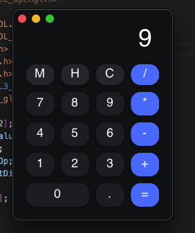
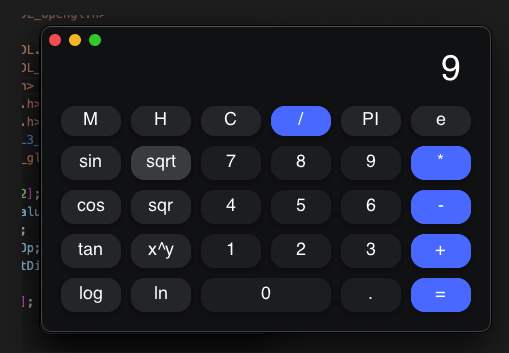
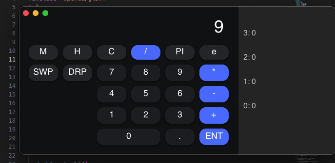
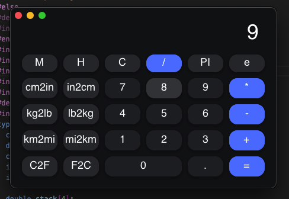
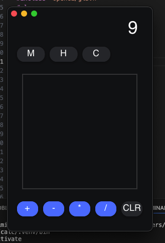

# Calculator

A fast, native calculator for macOS and Linux. It handles basic math, scientific functions, RPN (Reverse Polish Notation), and even recognizes your handwriting. (made just to flex my low level programming skills)



## Features

- **Multiple Modes**: Switch between Basic, Scientific, RPN, and Unit Conversion (Length, Mass, Temperature).
- **Handwriting Recognition**: You can draw digits on the grid. It uses a built-in neural network to understand what you're writing.
- **Modern UI**: Smooth, hardware-accelerated graphics using NanoVG.
- **Smart Layout**: The window is fully resizable and the buttons adjust automatically. Responsiveness in C! xD
- **History**: Keeps track of your calculations so you don't have to. 

### See it in action
[Watch the demo video](res/demo.mov)

## Highlights

| Mode | Preview |
| :--- | :--- |
| **Scientific** |  |
| **RPN** |  |
| **Unit Conversion** |  |
| **Drawing** |  |

## How to Build

### 1. Train the Neural Network
You'll need a `model.bin` file for the handwriting recognition to work. You can train it using the MNIST dataset:

```bash
cc -O2 -o train train.c -lm
./train
```
*Note: Make sure the MNIST dataset is in the `dataset/` folder.*

### 2. Build and Run
Make sure you have `SDL2` and `SDL2_ttf` installed.

```bash
make
./calc
```

## Project Structure

- `main.c`: The core of the app—UI, logic, and prediction.
- `train.c`: The code used to train the neural network.
- `res/`: screenshots of project
- `lib/` & `nanovg`: Libraries for rendering.

### made with Love by jai
